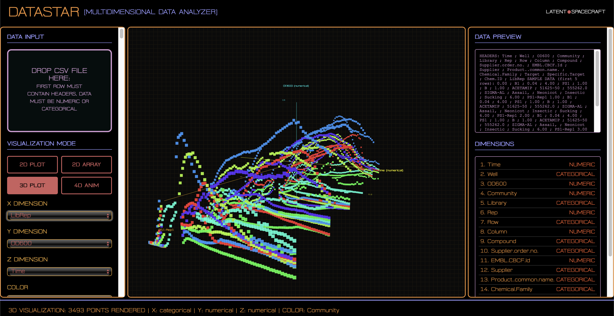
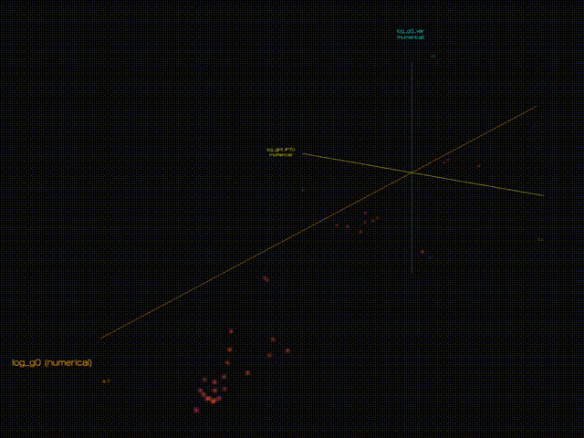

# DataStar - Multidimensional Data Analyzer

<div align="center">

![LS](https://img.shields.io/badge/LS-000000?style=for-the-badge&logo=data:image/svg+xml;base64,PD94bWwgdmVyc2lvbj0iMS4wIiBlbmNvZGluZz0iVVRGLTgiIHN0YW5kYWxvbmU9Im5vIj8+CjxzdmcKICAgd2lkdGg9IjQ4MCIKICAgaGVpZ2h0PSI0ODAiCiAgIHZpZXdCb3g9IjAgMCA0ODAgNDgwIgogICB2ZXJzaW9uPSIxLjEiCiAgIGlkPSJzdmczIgogICBzb2RpcG9kaTpkb2NuYW1lPSJsc19iYXNzLnN2ZyIKICAgaW5rc2NhcGU6dmVyc2lvbj0iMS4zICgwZTE1MGVkLCAyMDIzLTA3LTIxKSIKICAgeG1sbnM6aW5rc2NhcGU9Imh0dHA6Ly93d3cuaW5rc2NhcGUub3JnL25hbWVzcGFjZXMvaW5rc2NhcGUiCiAgIHhtbG5zOnNvZGlwb2RpPSJodHRwOi8vc29kaXBvZGkuc291cmNlZm9yZ2UubmV0L0RURC9zb2RpcG9kaS0wLmR0ZCIKICAgeG1sbnM9Imh0dHA6Ly93d3cudzMub3JnLzIwMDAvc3ZnIgogICB4bWxuczpzdmc9Imh0dHA6Ly93d3cudzMub3JnLzIwMDAvc3ZnIj4KICA8ZGVmcwogICAgIGlkPSJkZWZzMyIgLz4KICA8c29kaXBvZGk6bmFtZWR2aWV3CiAgICAgaWQ9Im5hbWVkdmlldzMiCiAgICAgcGFnZWNvbG9yPSIjZmZmZmZmIgogICAgIGJvcmRlcmNvbG9yPSIjMDAwMDAwIgogICAgIGJvcmRlcm9wYWNpdHk9IjAuMjUiCiAgICAgaW5rc2NhcGU6c2hvd3BhZ2VzaGFkb3c9IjIiCiAgICAgaW5rc2NhcGU6cGFnZW9wYWNpdHk9IjAuMCIKICAgICBpbmtzY2FwZTpwYWdlY2hlY2tlcmJvYXJkPSIwIgogICAgIGlua3NjYXBlOmRlc2tjb2xvcj0iI2QxZDFkMSIKICAgICBpbmtzY2FwZTp6b29tPSIwLjg5MTEyMzE1IgogICAgIGlua3NjYXBlOmN4PSIyNzguMzAwNDgiCiAgICAgaW5rc2NhcGU6Y3k9IjI2MC45MDY3IgogICAgIGlua3NjYXBlOndpbmRvdy13aWR0aD0iMTQ3MiIKICAgICBpbmtzY2FwZTp3aW5kb3ctaGVpZ2h0PSI4MjIiCiAgICAgaW5rc2NhcGU6d2luZG93LXg9IjAiCiAgICAgaW5rc2NhcGU6d2luZG93LXk9IjM3IgogICAgIGlua3NjYXBlOndpbmRvdy1tYXhpbWl6ZWQ9IjEiCiAgICAgaW5rc2NhcGU6Y3VycmVudC1sYXllcj0ic3ZnMyIKICAgICBpbmtzY2FwZTpleHBvcnQtYmdjb2xvcj0iIzAwMDAwMDAwIiAvPgogIDxwYXRoCiAgICAgZD0ibSA0MTAuNSw5NC40ODkgYyAzLjg1LC0xLjgyMyA3LjMzNywtMy4zNTQgNy43NDgsLTMuNDAyIDAuNDExLC0wLjA0OCAtMS4zMTMsMi43MTIgLTMuODMxLDYuMTMzIC00LjM5Nyw1Ljk3MiAtOC44NzUsMTMuMTcxIC0xNC4xNzMsMjIuNzggLTQuMzM1LDcuODYzIC0xNy45OTYsMjcuNjEyIC0yOC4zOCw0MS4wMjkgLTI1LjEzMiwzMi40NzIgLTYyLjA1OCw2Ni4wNDIgLTk5LjkzNCw5MC44NTEgbCAtOS41NjksNi4yNjggMC40MzQsMTYuMTc2IGMgMC4zNzUsMTMuOTgxIDAuMTMzLDE3LjYwMSAtMS43ODUsMjYuNjc2IC0yLjQ2NCwxMS42NTkgLTcuNTcxLDI1LjM0IC0xMi4xNjQsMzIuNTgyIC00Ljg1Miw3LjY1MSAtMTMuNzg2LDE5LjQxOCAtMTQuNzQyLDE5LjQxOCAtMC40ODUsMCAtMS4xODksLTEuNjg3IC0xLjU2NSwtMy43NSAtMS4yMTIsLTYuNjQ5IC03LjYwNywtMjEuNDg0IC0xMy42ODcsLTMxLjc1IC02Ljk4NywtMTEuNzk2IC0xNy4zNTcsLTI0LjUgLTIwLC0yNC41IC0xLjAxNSwwIC0zLjUzNSwxLjQ4NiAtNS41OTksMy4zMDEgLTIuMDY0LDEuODE2IC04LjQxLDYuNTkzIC0xNC4xMDIsMTAuNjE2IC01LjY5Miw0LjAyNCAtMTkuNDYsMTQuMTI1IC0zMC41OTUsMjIuNDQ5IC0yNC45ODMsMTguNjc1IC00My44MjgsMzIuMjcyIC03MS4wNTYsNTEuMjY5IC0zOS40MjcsMjcuNTA5IC00NC4wNTYsMzAuMzc0IC0yOC44NjcsMTcuODY1IDIuNjcyLC0yLjIgNy4zMzUsLTYuMjc1IDEwLjM2MiwtOS4wNTYgMy4wMjgsLTIuNzgyIDExLjEyOCwtOS45ODIgMTguMDAxLC0xNiA2Ljg3MywtNi4wMTkgMjQuNjYxLC0yMS43NDQgMzkuNTI4LC0zNC45NDQgMjUuODA0LC0yMi45MTEgMzYuNDk3LC0zMi4xOTUgNTMuMzkxLC00Ni4zNTggNC4xNzIsLTMuNDk4IDkuNjEsLTguMDYzIDEyLjA4NSwtMTAuMTQ1IGwgNC41LC0zLjc4NyAtMywtMy4xOTEgYyAtNS43NjYsLTYuMTM0IC00Ljk1OCwtNi41MDcgLTIyLjIyMywxMC4yNjQgLTIxLjkyOCwyMS4zMDEgLTQ1LjI5MSw0My4yMDIgLTYxLjc5NSw1Ny45MjkgLTcuNjksNi44NjIgLTIyLjk1LDIwLjk4NCAtMzMuOTExLDMxLjM4MiAtMjguODE2LDI3LjMzNiAtMzIuMDE5LDMwLjI2NSAtMzIuNTQyLDI5Ljc1NiAtMC4yNTksLTAuMjUyIC0wLjAxOCwtMC43NzIgMC41MzcsLTEuMTU0IDAuNTU0LC0wLjM4MyA1LjAzNCwtNS40MjEgOS45NTYsLTExLjE5NiA0LjkyMiwtNS43NzUgMTEuNjU1LC0xMy40NSAxNC45NjMsLTE3LjA1NSA4LjI4MywtOS4wMjUgMjYuNzM3LC0yOS43OTQgMzUuMDUsLTM5LjQ0NSA5LjA3NiwtMTAuNTM3IDM1LjM4MywtMzkuMTY2IDUzLjI1MSwtNTcuOTUzIDE2LjMxNSwtMTcuMTU1IDE2LjAzNiwtMTUuMDE0IDIuODI2LC0yMS43MSBDIDEzNS4wNDIsMjQ4LjQ1MiAxMTkuNjUxLDI0NC4wOCA5NSwyNDAuMzIzIGwgLTMuNSwtMC41MzMgNS42NzgsLTUuMTQ1IGMgMTEuNDczLC0xMC4zOTcgMjkuNDQ2LC0xOS4zNDYgNDguODIyLC0yNC4zMDkgMTMuMzkyLC0zLjQzIDM2LjI2LC01LjA0NyA0OS44NzIsLTMuNTI2IGwgMTAuMzk4LDEuMTYyIDEwLjYxNSwtOS43NjkgYyAyMC41NTUsLTE4LjkxNiAyOC4zNjgsLTI0LjkxMSA1OC42MTUsLTQ0Ljk3NSAyNS45LC0xNy4xOCA2NS44MTMsLTM2LjM2OCA5MSwtNDMuNzQ4IDE4Ljc5MSwtNS41MDYgMzcuMjU1LC0xMS43OTcgNDQsLTE0Ljk5MSBtIC03NS43MzcsNTAuMDc2IGMgNS42MzQsLTMuMDU3IDEzLjE1MSwtMC44NjggMTYuMTEzLDQuNjkyIEMgMzU0LjM5OSwxNTUuODY5IDM0Ny43MTUsMTY2IDMzOS44MjksMTY2IDMzNC4yOCwxNjYgMzI5LDE2MC45MDUgMzI5LDE1NS41NSBjIDAsLTQuNzEgMi4zMDgsLTkuMTEgNS43NjMsLTEwLjk4NSBtIC00OS41NDksMzEuMTAzIGMgMTAuMjk5LC0yLjE2MiAxOS44ODUsNC45MDQgMjAuMDM0LDE0Ljc2OSAwLjEyMyw4LjExOSAtNy41NTEsMTUuNTYzIC0xNi4wNDMsMTUuNTYzIC0yLjY2LDAgLTMuNDc1LC0wLjYwOSAtNS4xMTIsLTMuODE4IC0xLjA3MiwtMi4xIC0zLjgyNCwtNS41MTMgLTYuMTE2LC03LjU4NCAtMy44NTgsLTMuNDg1IC00LjExNywtNC4wMzggLTMuNDgyLC03LjQyMyAwLjc2OCwtNC4wOTMgNi45MzMsLTEwLjcxMSAxMC43MTksLTExLjUwNyIKICAgICBzdHJva2U9Im5vbmUiCiAgICAgZmlsbD0iIzBmMGYwZiIKICAgICBmaWxsLXJ1bGU9ImV2ZW5vZGQiCiAgICAgaWQ9InBhdGgzIgogICAgIHNvZGlwb2RpOm5vZGV0eXBlcz0iY3NjY2NjY2NjY3NzY3NjY2NjY3NjY2NjY2Njc3NjY3NjY2NjY2NjY2NjY2NjY2Njc3NjY2NzY2NjYyIKICAgICBzdHlsZT0iZmlsbDojZmZmZmZmIiAvPgogIDxnCiAgICAgaW5rc2NhcGU6Z3JvdXBtb2RlPSJsYXllciIKICAgICBpZD0ibGF5ZXIxIgogICAgIGlua3NjYXBlOmxhYmVsPSJMYXllciAyIj4KICAgIDxwYXRoCiAgICAgICBkPSJtIDI3MS4wMzUzMiwxODkuMDE5MjcgYyAtNy45NTc0NiwtMi45MDk5NiAtMTguMzYwMDEsLTAuMzY1MzMgLTI1Ljk3MjE0LDYuMzUxNTMgLTguNjU0Niw3LjYzNjY4IC05LjM1OTI5LDIzLjQzNTk0IC0xLjQ0NTk1LDMyLjQwNDA2IDExLjI0NjA5LDEyLjc0NTE0IDM3LjE1MTQxLDkuMDk5OTcgNDIuODEzNDcsLTYuMDIzMDQgNC43NjE4NSwtMTIuNzE2MTIgLTIuNDIwMiwtMjcuOTg2NTcgLTE1LjM5NTM4LC0zMi43MzI1NSIKICAgICAgIHN0eWxlPSJmaWxsOiNmNTVmMDY7ZmlsbC1vcGFjaXR5OjE7ZmlsbC1ydWxlOmV2ZW5vZGQ7c3Ryb2tlOm5vbmU7c3Ryb2tlLXdpZHRoOjIuMTU1MzkiCiAgICAgICBpZD0icGF0aDEtOCIgLz4KICA8L2c+Cjwvc3ZnPgo=)


&nbsp;&nbsp;&nbsp;

*A powerful, multidimensional data visualization platform developed by LATENT•SPACECRAFT, inspired by Michael Okuda and Vintage Audio*

</div>

## **✶ Overview**

DataStar is a browser-based data visualization terminal that transforms CSV data into stunning 2D, 3D, 4D, 5D, and 6D visualizations. Built with a distinctive retrofuturistic aesthetic reminiscent of classic sci-fi interfaces and developed by LATENT•SPACECRAFT, it provides powerful visualization capabilities without requiring coding experience.

### ✨ Key Features

- **🎨 Retrofuturistic UI**: Inspired by 1970s space exploration
- **📊 Multiple Visualization Modes**: 2D plots, interactive 2D arrays, 3D point clouds, 4D time-lapse animations
- **🌈 6-Dimensional Support**: X, Y, Z positioning + Color, Size, and Time dimensions
- **🖱️ Interactive Controls**: Manual camera rotation/zoom for 2D arrays, 3D, and 4D modes
- **📅 Smart Data Detection**: Automatic numerical, categorical, and datetime parsing with proper temporal ordering
- **⚡ Real-time Rendering**: WebGL-accelerated graphics with Three.js and custom particle shader
- **🎛️ Animation Controls**: Variable speed sliders and temporal navigation for 4D datasets
- **📊 Advanced Axis System**: Extended labeled axes with categorical value support and data type indicators
- **🔍 Data Filtering**: Real-time range sliders for numerical data and checkbox filters for categories, autoscaling axes
- **📤 Export Capabilities**: PNG images, 3D mesh (.obj), animated GIFs (4D data), and filtered CSV export
- **✨ Particle Effects**: Sophisticated particle system with shimmer effects and lifetime management
- **🔧 Modular Architecture**: Easily extensible for new visualization types

## 🏗️ Architecture

### Core Components

```
DataStar/
├── DropViz Class           # Main drag-drop application controller
├── Visualization Engine    # Three.js rendering system with particle effects
├── Data Processing         # CSV parsing, filtering, and normalization
├── Interactive Controls    # Mouse/touch camera manipulation
├── Particle System         # Advanced 4D animation with fade effects
├── Filter System           # Real-time data range and category filtering
├── UI Controller           # Event handling and user interaction
└── Export System           # PNG, OBJ, GIF, and CSV export functionality
```

### Class Structure

```javascript
class DropViz {
    constructor()              // Initialize application
    init()                     // Setup event listeners and Three.js
    
    // Data Management
    processFile(file)          // Parse CSV files with PapaParse
    populateDimensionSelectors() // Update UI with available dimensions
    updateDataPreview()        // Display data sample and headers
    
    // Visualization Methods
    create2DVisualization()    // 2D scatter plots
    create2DArrayVisualization() // Height-mapped grid cubes
    create3DVisualization()    // 3D point clouds with rotation
    create4DVisualization()    // Time-lapse animations
    
    // Three.js Management
    initializeThreeJS()        // Setup scene, camera, renderer
    animate()                  // Main render loop
    addAxisLines()             // 2D axis visualization
    add3DAxisLines()           // 3D axis visualization
    
    // Export Functions
    exportPNG()                // Canvas-to-image export
    exportMesh()               // OBJ format 3D export
}
```

## 📋 Current Implementation Status

### ✅ Completed Features

- [x] **Core UI Framework**: Retrofuturistic styling with CSS Grid layout and LATENT•SPACECRAFT branding
- [x] **File Processing**: Drag-and-drop CSV parsing with PapaParse and comprehensive data validation
- [x] **2D Visualization**: Interactive scatter plots with axis lines and color coding
- [x] **2D Array Visualization**: Interactive grid-based height mapping with manual camera controls
- [x] **3D Visualization**: Point clouds with full camera manipulation (rotation/zoom)
- [x] **4D Visualization**: Advanced particle-based time-lapse animations with fade effects
- [x] **5D/6D Support**: Color and size dimensions for enhanced data representation
- [x] **Smart Data Detection**: Automatic numerical, categorical, and datetime parsing with temporal ordering
- [x] **Interactive Controls**: Comprehensive mouse/touch rotation and zoom for all 3D modes
- [x] **Advanced Axis System**: Extended labeled axes with data type indicators and range labels
- [x] **Categorical Support**: Full grouping and visualization of non-numerical data
- [x] **Particle System**: Sophisticated 4D animation with shimmer effects and lifetime management
- [x] **Data Filtering**: Real-time range sliders and category checkboxes with live preview
- [x] **Animation System**: Robust temporal navigation with variable speed controls
- [x] **Data Preview**: Real-time header analysis and filtered sample display
- [x] **Dimension Management**: Dynamic selector population with type validation
- [x] **Export System**: PNG, OBJ mesh, animated GIF, and filtered CSV export
- [x] **Error Handling**: Comprehensive validation and user feedback system
- [x] **Responsive Design**: Dynamic viewport scaling and adaptive layout
- [x] **Performance Optimization**: Efficient particle systems and memory management

### 🪰 Known Bugs (Remedying is top priority)
- GIF Export freezes browser
- Color mapping for 2D Arrays fails

### 🔄 In Progress Features

- [ ] **Value Hover Display**: Point inspection with data value tooltips
- [ ] **Color Schemes**: Common color palettes and palette brewer
- [ ] **Advanced Interactions**: Point selection and highlighting system

## 💫 Release v0.1.0 - Current Features

DataStar v0.1.0 represents a fully functional, production-ready data visualization platform with the following capabilities:

### 🎨 **Visualization Modes**
- **2D Scatter Plots**: Traditional X/Y plotting with interactive controls
- **2D Interactive Arrays**: Height-mapped cube grids with full 3D camera manipulation
- **3D Point Clouds**: Full 6-dimensional data representation (X, Y, Z, Color, Size, Time)
- **4D Animations**: Advanced particle-based temporal visualization with fade effect

### 🎛️ **Control Systems**
- **Data Filtering**: Real-time numerical range sliders and categorical checkboxes
- **Animation Controls**: Variable speed 4D temporal navigation (0.01s - 5.0s intervals)
- **Camera Manipulation**: Mouse/touch rotation and zoom for all 3D visualizations
- **Auto-rotation Toggle**: Automatic camera movement for presentation mode

### 📊 **Data Intelligence**
- **Smart Detection**: Automatically identifies numerical, categorical, and datetime columns
- **Temporal Ordering**: Proper chronological sorting for datetime data in animations
- **Mixed Data Support**: Seamlessly handles datasets with multiple data types
- **Real-time Validation**: Comprehensive error checking and user feedback

### 📤 **Export Capabilities**
- **PNG Export**: High-resolution static image export
- **3D Mesh Export**: OBJ format for 3D modeling applications
- **Animated GIF**: True GIF generation for 4D animations
- **Filtered CSV**: Export current filtered dataset

### 🎯 **Planned Enhancements**

- [ ] **Statistical Overlays**: Regression lines, confidence intervals, clustering
- [ ] **Value Hover Display**: Interactive point inspection with data tooltips
- [ ] **Network Graphs**: Node-link diagrams for relationship data
- [ ] **Heatmaps**: 2D density and correlation matrices
- [ ] **Color Schemes**: Multiple palettes and custom color mapping
- [ ] **Collaborative Features**: Shareable visualization URLs
- [ ] **Data Transforms**: Built-in preprocessing and normalization options

## 🛠️ Development Setup

### Prerequisites

- Modern web browser with WebGL 2.0 support
- Text editor or IDE (VS Code recommended)
- Basic understanding of JavaScript ES6+
- Familiarity with Three.js (helpful but not required)

### Dependencies

The application uses CDN-hosted libraries for easy deployment:

```html
<!-- Three.js for 3D rendering -->
<script src="https://cdnjs.cloudflare.com/ajax/libs/three.js/r128/three.min.js"></script>

<!-- PapaParse for CSV processing -->
<script src="https://cdnjs.cloudflare.com/ajax/libs/PapaParse/5.3.0/papaparse.min.js"></script>

<!-- Google Fonts for typography -->
<link href="https://fonts.googleapis.com/css2?family=Orbitron:wght@400;700;900&display=swap" rel="stylesheet">
```

### Quick Start

1. **Clone or download** the HTML file
2. **Open in browser** - no build process required (*Tested on Safari 18.6, Chrome 138.x, Edge 139.x*)
3. **Drop a CSV file** to begin visualization
4. **Select dimensions** using the control panel
5. **Switch visualization modes** with the mode buttons

### Development Workflow

```bash
# For local development with live reload
python -m http.server 8000  # Python 3
# or
python -m SimpleHTTPServer 8000  # Python 2
# or
npx serve .  # Node.js

# Open browser to localhost:8000
```

## 🧪 Testing

### Test Data Format

DataStar expects "numpy-compliant" CSV files:
- **First row**: Column headers
- **Subsequent rows**: Numerical, categorical, or datetime data
- **No missing headers**: Each column must be named
- **Date Formats Supported**: ISO (YYYY-MM-DD), US (MM/DD/YYYY), European (DD/MM/YYYY), and common variations

### Sample Test CSV

```csv
Time,Temperature,Pressure,Humidity,Energy,Phase,Date
1,20.5,1013.2,45.0,150.3,Solid,2023-01-15
2,25.1,1012.8,48.5,165.7,Solid,2023-01-16
3,30.2,1011.5,52.1,180.2,Liquid,2023-01-17
4,35.8,1010.2,55.3,195.1,Liquid,2023-01-18
# ... more rows
```

### Test Scenarios

1. **2D Visualization**: Temperature vs Energy (linear correlation)
2. **3D Visualization**: Temperature/Pressure/Humidity (3D cloud with manual controls)
3. **4D Animation**: Use Time or Date dimension for temporal animation
4. **5D/6D**: Add Color (Phase) and Size (Energy) dimensions
5. **Categorical Data**: Phase transitions and categorical groupings
6. **DateTime Parsing**: Proper chronological ordering of date columns
7. **Mixed Data Types**: Numerical, categorical, and datetime in same dataset
8. **Edge Cases**: Single column, all categorical, empty cells, malformed dates

## 🎨 Visual Design System

### Sample UI Color Palette

```css
:root {
    --primary-orange: #e88d34; /*UI Scaffold*/
    --primary-lilac: #9799fe; /*Labels*/
    --secondary-lavender: #d099d0; /*Raw Data*/
    --accent-yellow: #efa937;
    --accent-rose: #cd5f5e; /*User Input*/
    --bg-dark: #000000; /*Background*/
    --bg-panel: #000000; /*Panel Background*/
    --text-primary: #e88d34; /*Primary Text*/
    --text-secondary: #fc5f2c; /*Secondary Text*/
    --grid-color: #333333;
}
```

### Typography

- The *"Two Weekends Sans"* font by T. X. Zhang is redistributed here under its original [license](OFL.md).


## 🔧 Extension Guide

### Adding New Visualization Types

1. **Create Visualization Method**:
```javascript
createMyNewVisualization(dimensions) {
    // Clear existing scene objects
    while (this.scene.children.length > 2) {
        this.scene.remove(this.scene.children[2]);
    }
    
    // Process data and create geometry
    const geometry = new THREE.BufferGeometry();
    // ... your visualization logic
    
    // Add to scene
    this.scene.add(meshOrPoints);
    
    // Update status
    this.updateStatus('NEW VISUALIZATION: X OBJECTS RENDERED');
}
```

2. **Add UI Controls**:
```html
<button class="viz-button" data-mode="my-new-mode">My Viz</button>
```

3. **Update Switch Statement**:
```javascript
case 'my-new-mode':
    this.createMyNewVisualization(xDim, yDim, ...);
    break;
```

### Adding Data Processing Features

```javascript
// Example: Data filtering
filterData(dimension, minValue, maxValue) {
    return this.data.filter(row => {
        const value = row[dimension];
        return typeof value === 'number' && 
               value >= minValue && 
               value <= maxValue;
    });
}

// Example: Statistical calculations
calculateStats(dimension) {
    const values = this.data
        .map(row => row[dimension])
        .filter(v => typeof v === 'number');
    
    return {
        mean: values.reduce((a, b) => a + b) / values.length,
        min: Math.min(...values),
        max: Math.max(...values),
        std: Math.sqrt(values.reduce((sq, n) => sq + Math.pow(n - mean, 2), 0) / values.length)
    };
}
```

### Adding Export Formats

```javascript
exportCustomFormat() {
    // Generate custom format data
    const customData = this.generateCustomFormat();
    
    // Create download
    const blob = new Blob([customData], { type: 'application/custom' });
    const link = document.createElement('a');
    link.download = `dropviz_export_${Date.now()}.custom`;
    link.href = URL.createObjectURL(blob);
    link.click();
    
    this.updateStatus('CUSTOM EXPORT COMPLETE');
}
```

## 🐛 Known Issues & Limitations

### Current Limitations

1. **Memory Usage**: Large datasets (>10k points) may impact performance
2. **Mobile Support**: Experimental--Touch controls partially implemented for 3D
3. **Browser Storage**: No persistence between sessions
4. **Advanced Date Formats**: Some exotic date formats may require preprocessing

### Performance Considerations

- **Point Cloud Limits**: Optimal performance with <5000 points; tested with up to 130MB CSV files
- **DateTime Processing**: Large date columns may have slight parsing overhead

### Browser Compatibility

- **WebGL 2.0**: Required for Three.js rendering
- **ES6+ Features**: Modern JavaScript syntax used throughout
- **File API**: For drag-and-drop file handling
- **Canvas API**: For PNG export functionality

## 🤝 Contributing

### Code Style

- **ES6+ Syntax**: Use modern JavaScript features
- **Consistent Naming**: camelCase for variables, PascalCase for classes
- **Modular Design**: Keep methods focused and reusable
- **Error Handling**: Always validate inputs and provide user feedback

### Pull Request Process

1. **Fork** the repository
2. **Create feature branch**: `git checkout -b feature/amazing-viz`
3. **Test thoroughly** with various CSV formats
4. **Update documentation** for new features
5. **Submit pull request** with clear description

## 📈 Roadmap

### Phase 1: Core Stability (Current)
- ✅ Basic visualization modes
- ✅ File processing pipeline
- ⚠️ Export functionality (GIF broken)
- 🔄 Performance optimization
- 🔄 Mobile responsiveness

### Phase 2: Enhanced Interactivity
- ✅ Manual camera controls
- ✅ Real-time filtering and brushing
- 🎯 Data point selection and highlighting
- 🎯 Collaborative sharing features

### Phase 3: Advanced Analytics
- 🎯 Statistical model overlay
- 🎯 Machine learning integration
- 🎯 Time series analysis tools
- 🎯 Network analysis capabilities w/ JS

## 🔒 Security

### File Processing
- **Client-side Only**: **No data upload**, all processing in browser on-device
- **File Type Validation**: Only CSV files accepted
- **Size Limits**: Consider implementing file size restrictions
- **Content Sanitization**: PapaParse handles malformed CSV safely

### XSS Prevention
- **No Dynamic HTML**: Data displayed in controlled contexts
- **CSV Content**: Treated as data, not executable code
- **User Input**: Minimal attack surface with file-only input

## 📄 License

This project is open source and available under the [GPLv3 License](LICENSE).

---

<div align="center">

**EXCELSIOR**

[Report Bug](https://github.com/latent-spacecraft/datastar/issues) · [Request Feature](https://github.com/latent-spacecraft/datastar/issues) · [Contribute](https://github.com/latent-spacecraft/datastar/pulls)

</div>